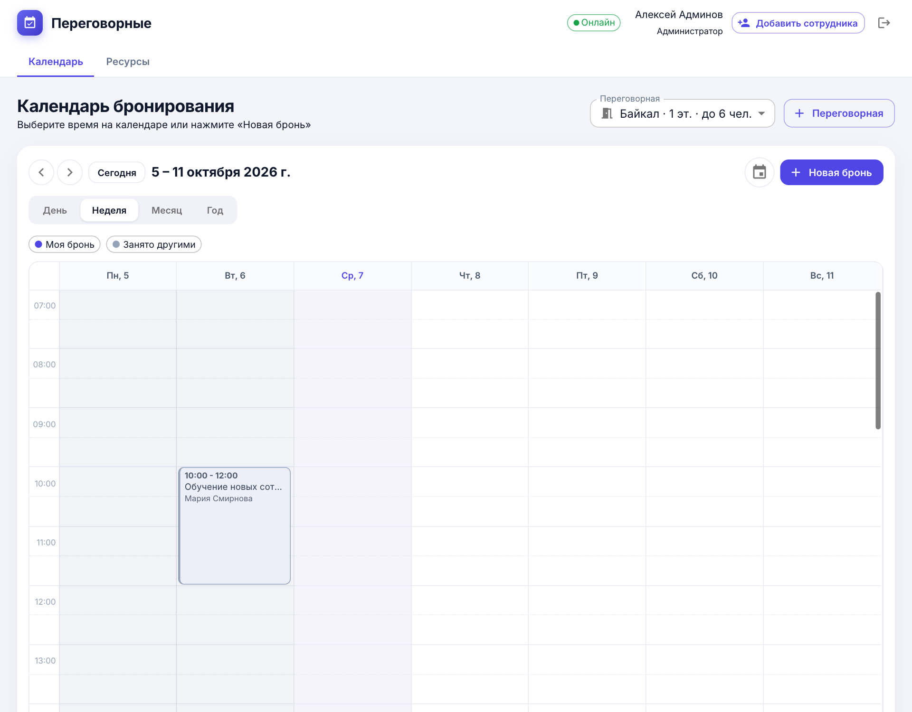
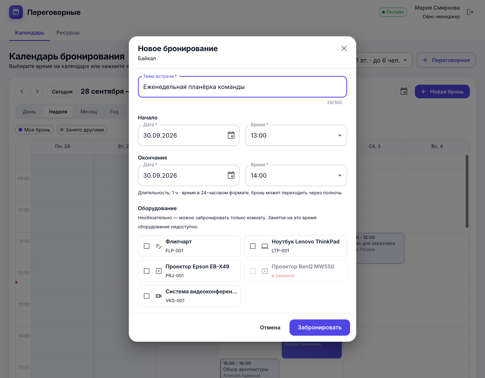
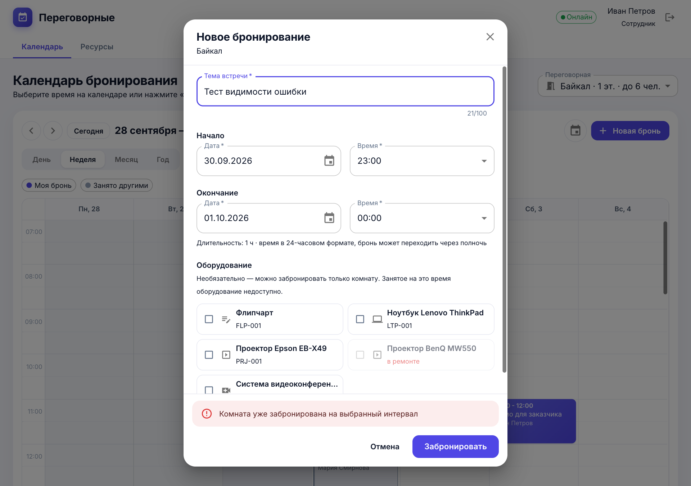
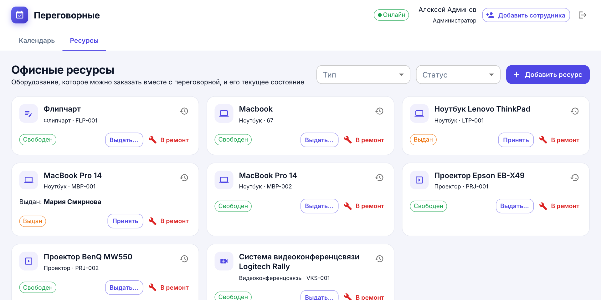
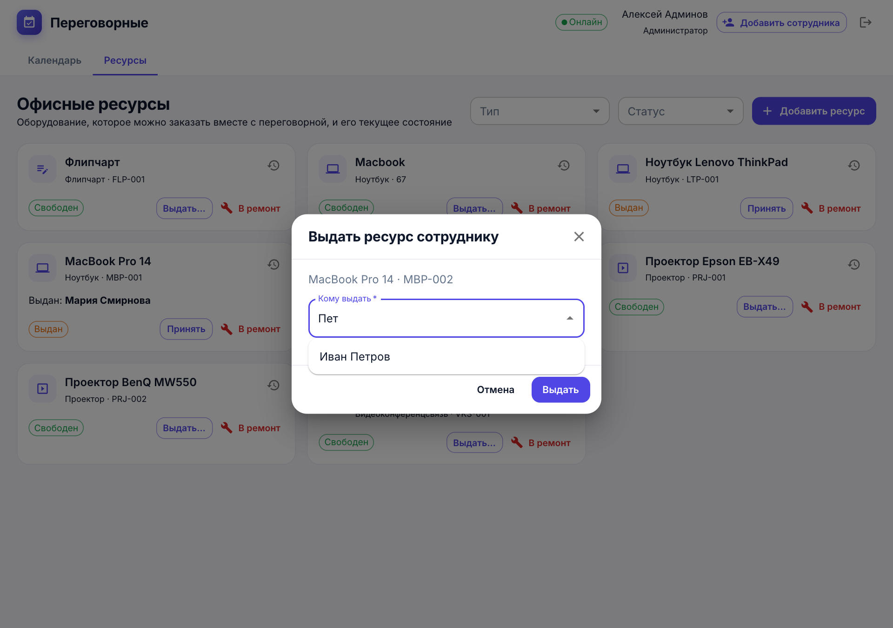
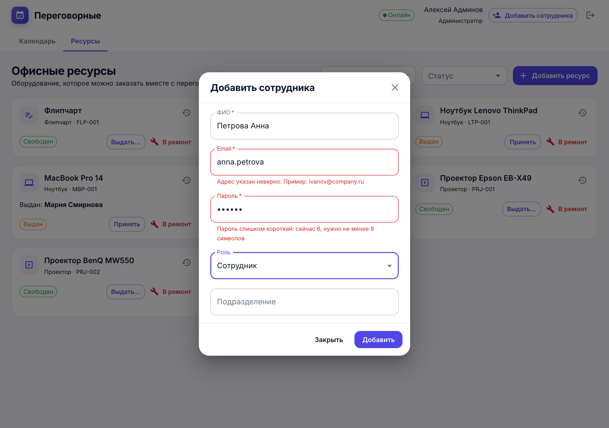
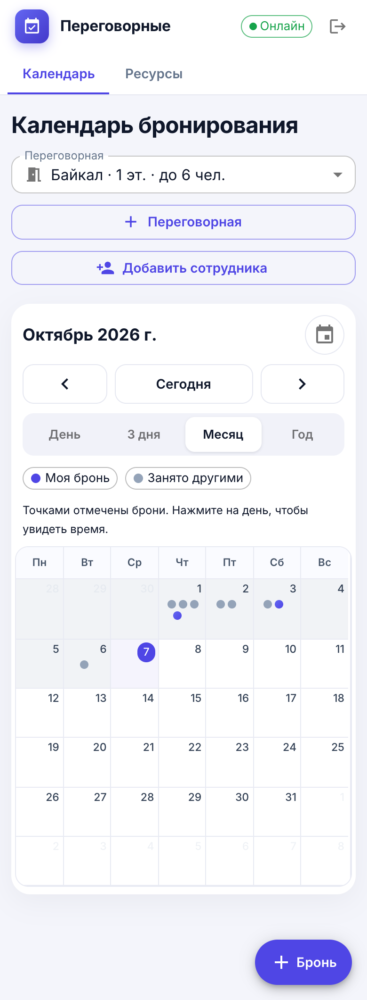
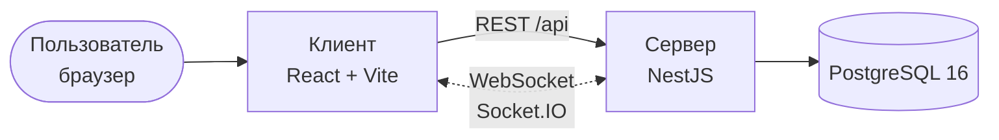
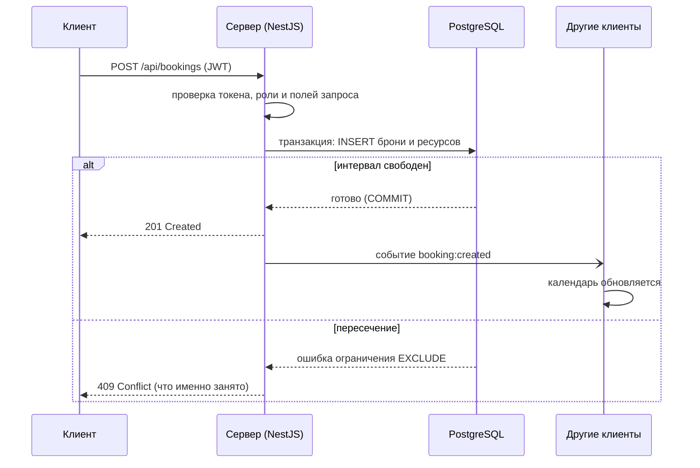

<div align="center">

# 🏢 Office Booking

**Бронирование переговорных комнат и учёт офисных ресурсов**

Сотрудники занимают комнату вместе с проектором или ноутбуком за пару кликов,
офис-менеджер видит, где какая техника, а календарь у всех обновляется без перезагрузки страницы.




</div>

## Содержание

- [Для чего создан проект](#для-чего-создан-проект)
- [Возможности](#возможности)
- [Как это работает](#как-это-работает)
- [Быстрый старт](#быстрый-старт)
- [Запуск в контейнерах](#запуск-в-контейнерах)
- [Роли и права](#роли-и-права)
- [Программный интерфейс](#программный-интерфейс)
- [Настройки](#настройки)
- [Тесты](#тесты)
- [Структура проекта](#структура-проекта)
- [Частые проблемы](#частые-проблемы)

## Для чего создан проект

В большинстве компаний переговорные комнаты бронируют «как получится»: в общем календаре, в мессенджере или у офис-менеджера по телефону. Из-за этого:

- два отдела приходят в одну комнату на одно и то же время;
- проектор или ноутбук оказывается выданным в другую комнату или сломанным, а узнают об этом перед самой встречей;
- нет единой картины, где что лежит и кто что брал.

**Office Booking** решает это одной системой: комната и оборудование бронируются вместе, а пересечения невозможны **технически** – их запрещает сама база данных, а не вежливая проверка в интерфейсе.

> Проект выполнен как выпускная квалификационная работа (НИУ «МЭИ», кафедра БИТ, автор – Личино Виктория).

## Возможности

| | |
|---|---|
| 📅 **Календарь** | Режимы «День», «Неделя», «3 дня» (на телефоне), «Месяц», «Год»; у каждой комнаты свой календарь |
| 🚪 **Бронь комнаты и оборудования** | Одна форма: комната, время, тема, нужная техника. От 15 минут до 7 суток, можно через полночь |
| ✏️ **Изменение и отмена** | Нажмите на бронь в календаре: можно поменять тему, время и оборудование. Перед сохранением и отменой приложение просит подтверждение |
| 🛡️ **Без двойных бронирований** | Даже если двое нажмут «Забронировать» в одну секунду, создастся только одна бронь, вторая получит понятное сообщение |
| 🖥️ **Учёт ресурсов** | Статусы «Свободен», «Выдан», «В ремонте», отметка «занято на выбранное время». Ресурс выдаётся **конкретному сотруднику**, на карточке видно, у кого он, а журнал хранит каждую операцию. Несколько одинаковых единиц (например, 2 MacBook) добавляются за раз и получают отдельные номера: `MBP-001`, `MBP-002` |
| ⚡ **Реальное время** | Чужая бронь появляется в вашем календаре сама (WebSocket) |
| 🔐 **Роли и вход** | Сотрудник, офис-менеджер, администратор; вход по email и паролю, выход из аккаунта только после подтверждения |
| 💬 **Понятные ошибки** | Поля проверяются до отправки, сообщения на русском под каждым полем: что именно исправить |
| 📱 **Адаптивность** | От телефона (360 px) до широкого монитора. В месячном виде на телефоне брони отмечены точками, нажатие на день открывает его расписание |

<table>
  <tr>
    <td width="50%"><br><sub>Форма бронирования с выбором оборудования</sub></td>
    <td width="50%"><br><sub>Комната занята: сообщение видно сразу, без прокрутки</sub></td>
  </tr>
  <tr>
    <td width="50%"><br><sub>Каталог ресурсов: статусы и держатель техники</sub></td>
    <td width="50%"><br><sub>Выдача ресурса выбранному сотруднику</sub></td>
  </tr>
  <tr>
    <td width="50%"><br><sub>Ошибки в форме – на русском, под полем</sub></td>
    <td width="50%"><br><sub>Месяц на телефоне: брони точками</sub></td>
  </tr>
</table>

## Как это работает

### Архитектура

Одностраничное приложение на React общается с сервером по REST и по WebSocket. Сервер – модульный монолит на NestJS, все данные хранятся в PostgreSQL.



В режиме контейнеров перед ними стоит Nginx: он направляет `/api` и `/socket.io` на сервер, остальное – на клиент.

### Как создаётся бронь

Проверка пересечений выполняется **внутри базы данных** одним атомарным действием, поэтому гонки между пользователями невозможны:



Ключевая идея – ограничения `EXCLUDE USING gist` в PostgreSQL: база сама отказывается сохранять две брони одной комнаты (или одного ресурса) с пересекающимися интервалами времени. Что бы ни случилось в коде или интерфейсе, двойное бронирование не попадёт в данные.

### Данные

Шесть таблиц: `users`, `rooms`, `resources` (у выданного ресурса заполнено `holder_id` – кто его держит), `bookings`, `booking_resources` (какое оборудование взято на бронь) и `resource_logs` (журнал выдачи с получателем, приёма и ремонта). Схема описана в [`backend/prisma/schema.prisma`](backend/prisma/schema.prisma), миграции лежат рядом.

## Быстрый старт

Режим разработки: база в контейнере, сервер и клиент запускаются на вашей машине.

**Нужно:** [Node.js](https://nodejs.org/) 24, npm и [Docker](https://www.docker.com/) (для PostgreSQL).

**1. База данных** (из корня проекта):

```bash
docker compose up -d
```

**2. Сервер** – http://localhost:3001:

```bash
cd backend
cp .env.example .env
npm install
npx prisma migrate deploy
npx prisma generate
npx prisma db seed
npm run start:dev
```

> Запускайте сервер через `npm run start` или `npm run start:dev` (Nest CLI). Прямой запуск `tsx src/main.ts` ломает внедрение зависимостей NestJS.

**3. Клиент** – http://localhost:5173, в новом терминале:

```bash
cd frontend
npm install
npm run dev
```

Откройте http://localhost:5173 и войдите под демонстрационным пользователем.

### Демонстрационные пользователи

Создаются командой `npx prisma db seed` (вместе с четырьмя переговорными и пятью единицами оборудования). Пароль задан в `backend/prisma/seed.ts` (константа `DEMO_PASSWORD`) и предназначен только для локальной разработки.

| Email                  | Роль          |
|------------------------|---------------|
| `employee@example.com` | Сотрудник     |
| `manager@example.com`  | Офис-менеджер |
| `admin@example.com`    | Администратор |

## Запуск в контейнерах

Поднимает PostgreSQL, сервер, клиент и Nginx как единую точку входа:

```bash
JWT_SECRET=<длинная-случайная-строка> docker compose --profile full up -d --build
docker compose exec backend npx prisma db seed   # демонстрационные данные (по желанию)
```

Приложение откроется на http://localhost:8080.

> Для рабочей эксплуатации обязательно задайте свой `JWT_SECRET` и смените пароли пользователей. Значение по умолчанию в `docker-compose.yml` годится только для разработки.

## Роли и права

| Действие                                  | Сотрудник | Офис-менеджер | Администратор |
|-------------------------------------------|:---------:|:-------------:|:-------------:|
| Просмотр комнат, ресурсов, бронирований   |    ✅     |      ✅       |      ✅       |
| Создание, изменение, отмена своей брони   |    ✅     |      ✅       |      ✅       |
| Изменение и отмена чужой брони            |    ❌     |      ✅       |      ✅       |
| Добавление комнаты                        |    ❌     |      ✅       |      ✅       |
| Добавление ресурса, смена его статуса     |    ❌     |      ✅       |      ✅       |
| Регистрация нового сотрудника             |    ❌     |      ❌       |      ✅       |

Самостоятельной регистрации нет: учётные записи создаёт администратор.

## Программный интерфейс

Интерактивная документация (Swagger): http://localhost:3001/api/docs. Все методы, кроме входа, требуют заголовок `Authorization: Bearer <токен>`.

| Метод | Путь | Что делает | Кто может |
|-------|------|------------|-----------|
| `POST`  | `/api/auth/login` | Вход, выдача токена | все |
| `POST`  | `/api/auth/register` | Регистрация сотрудника | администратор |
| `GET`   | `/api/users` | Список сотрудников | авторизованные |
| `GET`   | `/api/rooms` | Список комнат | авторизованные |
| `POST`  | `/api/rooms` | Добавить комнату | менеджер, администратор |
| `GET`   | `/api/rooms/:id/availability` | Занятость комнаты на интервал | авторизованные |
| `GET`   | `/api/resources` | Ресурсы с отметкой «занято на интервал» | авторизованные |
| `POST`  | `/api/resources` | Добавить ресурс; параметр `quantity` (до 50) создаёт несколько одинаковых единиц | менеджер, администратор |
| `GET`   | `/api/resources/:id/history` | Журнал операций ресурса | авторизованные |
| `PATCH` | `/api/resources/:id/status` | Выдать (обязателен `holderId` – получатель), принять, отправить в ремонт | менеджер, администратор |
| `GET`   | `/api/bookings` | Брони за интервал | авторизованные |
| `POST`  | `/api/bookings` | Создать бронь | авторизованные |
| `PATCH` | `/api/bookings/:id` | Изменить бронь (тема, время, оборудование) | автор, менеджер, администратор |
| `DELETE`| `/api/bookings/:id` | Отменить бронь | автор, менеджер, администратор |

**События WebSocket** (Socket.IO): клиент подписывается на комнату событием `room:subscribe` (отписка – `room:unsubscribe`), а сервер присылает `booking:created`, `booking:updated` и `booking:cancelled`.

## Настройки

Файл `backend/.env` (шаблон – `backend/.env.example`; в репозиторий он не попадает):

| Переменная               | Назначение                                  | По умолчанию       |
|--------------------------|---------------------------------------------|--------------------|
| `DATABASE_URL`           | Адрес подключения к PostgreSQL              | см. `.env.example` |
| `PORT`                   | Порт сервера                                | `3001`             |
| `JWT_SECRET`             | Секретный ключ подписи токенов (обязателен) | задайте свой       |
| `JWT_EXPIRES_IN_SECONDS` | Срок действия токена, секунд                | `43200` (12 часов) |

## Тесты

Команды выполняются в каталоге `backend`. Для интеграционных тестов и нагрузки нужна запущенная база с начальными данными (`npx prisma db seed`).

```bash
npm test            # 29 модульных тестов, база не нужна
npm run test:e2e    # 43 интеграционных теста на реальной PostgreSQL
npm run test:load   # нагрузка: 50 пользователей (сервер должен быть запущен)
npm run lint        # статический анализ
```

Клиент: `npm run lint` и `npm run build` (проверка типов и сборка) в каталоге `frontend`.

Что проверяют тесты: права ролей, создание, изменение и отмену броней, выдачу ресурса сотруднику, создание нескольких единиц, русские сообщения об ошибках, бронь «встык» и через полночь, невозможность взять одно оборудование в двух комнатах одновременно и главное – **одновременные запросы на один слот: из 50 создаётся ровно одна бронь, остальные получают 409**.

## Структура проекта

```
office-booking/
├── backend/                 сервер (NestJS)
│   ├── prisma/              схема БД, миграции, начальные данные (seed.ts)
│   ├── src/
│   │   ├── auth/            вход, регистрация, JWT, проверка ролей
│   │   ├── bookings/        бронирования и WebSocket-шлюз
│   │   ├── rooms/           переговорные комнаты
│   │   ├── resources/       офисные ресурсы и журнал операций
│   │   ├── users/           справочник сотрудников
│   │   └── prisma/          подключение к базе данных
│   └── test/                интеграционные тесты и нагрузочный скрипт
├── frontend/                клиент (React)
│   └── src/
│       ├── features/        auth, bookings, resources, admin
│       ├── shared/          запросы к API, WebSocket, роли, общие компоненты
│       └── app/             хранилище Redux
├── nginx/                   конфигурация обратного прокси
├── docs/screenshots/        скриншоты для этого README
└── docker-compose.yml       PostgreSQL и (по профилю full) вся система
```

### Технологии

| Часть   | Что используется |
|---------|------------------|
| Сервер  | Node.js 24, TypeScript, NestJS 12, Prisma 7, Socket.IO, JWT (passport-jwt), bcrypt, class-validator, Swagger |
| База    | PostgreSQL 16 с ограничениями `EXCLUDE` |
| Клиент  | React 19, TypeScript, Vite, Material UI, FullCalendar, Redux Toolkit (RTK Query), socket.io-client |
| Тесты   | Vitest, Supertest |
| Запуск  | Docker, Docker Compose, Nginx |

## Частые проблемы

| Симптом | Что делать |
|---------|------------|
| Порт 3000 занят | Это нормально: сервер проекта работает на порту **3001** |
| Ошибка подключения к базе | Проверьте, что контейнер запущен (`docker compose ps`), а `DATABASE_URL` в `.env` совпадает с настройками `docker-compose.yml` |
| `Cannot find module '../generated/client'` | Не выполнена команда `npx prisma generate` |
| Вход не проходит | Выполните `npx prisma db seed` |
